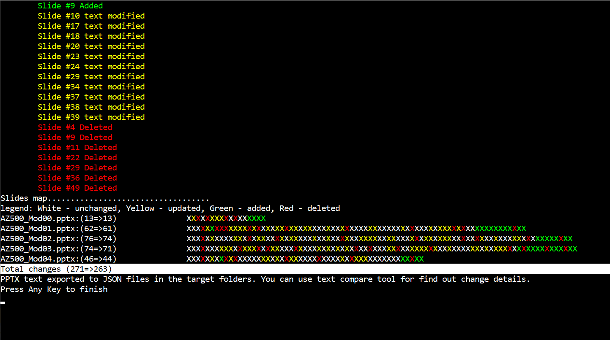
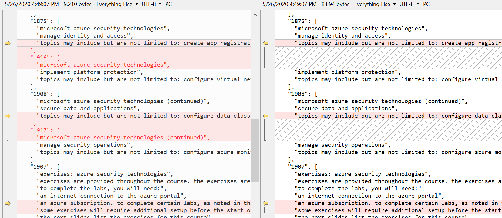

# PPT Compare tool
                
by Alex Ivanov - 2019 v2

## Description
Provide path to the original(old) and modified(new) version.
Comparing will be done ONLY for files with the SAME name.

## Release

- [v1](/Release/PPT-Comparer_v1.zip) compare text on the slides.
- [v2](/Release/PPT-Comparer_v2.zip) compare text and image modification.
- [v3](/Release/PPT-Comparer_v3.zip) compare text, image and slide note modification.
- [v4](/Release/PPT-Comparer_v4.zip) migration to Net 4.8, upgrade packages.
  
## Usage
example for folders: 

```cmd
pptx-comparer.exe  c:\temp\old  c:\temp\new
```
example for files: 

```cmd
pptx-comparer.exe  c:\temp\old\demo.pptx  c:\temp\new\demo.pptx**
```

## Example of output



## Analyzing

Compare exported JSONs to find out details.


